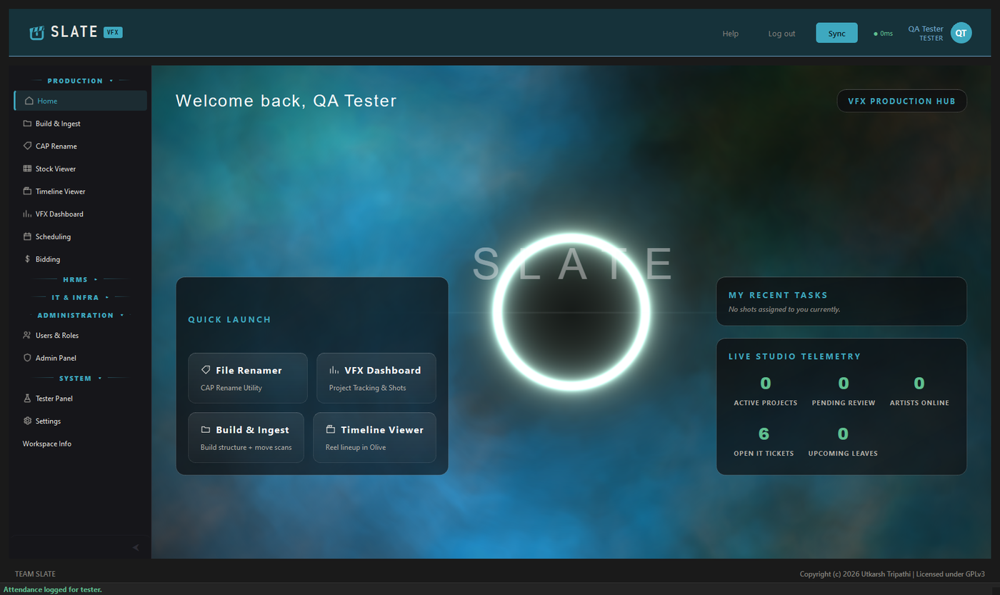
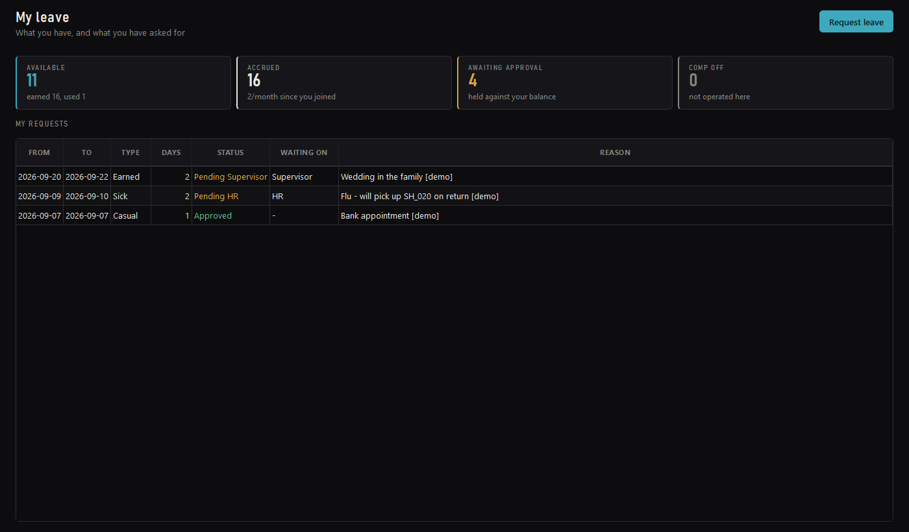
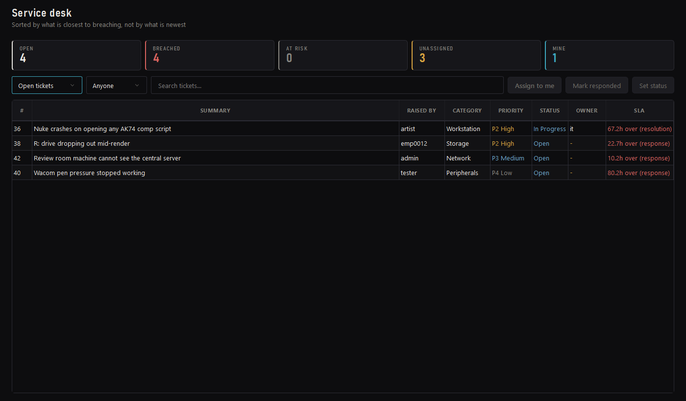
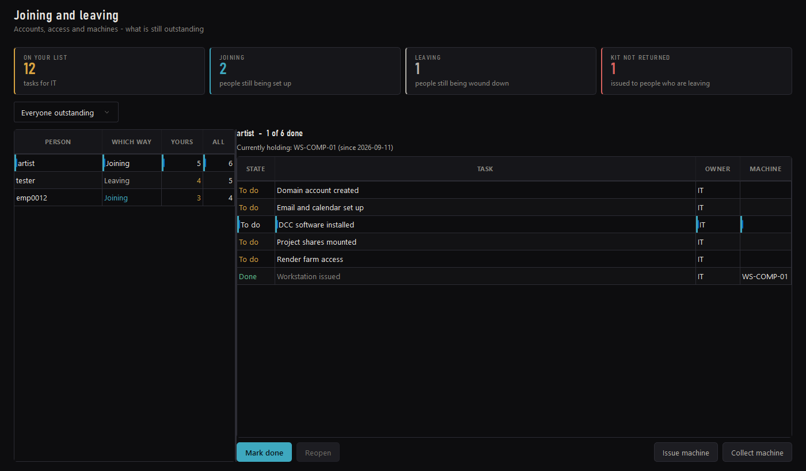
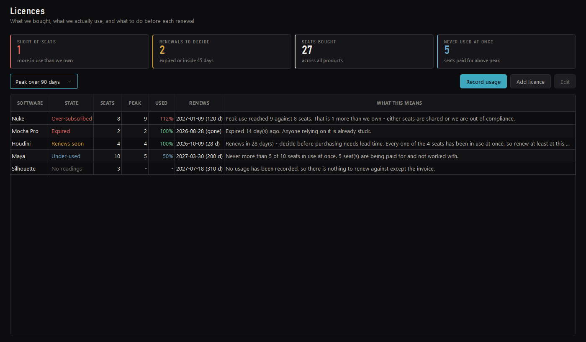

# Slate

**A studio pipeline that also knows the studio runs on people.**

Slate is a desktop tool for a VFX facility. It does the usual pipeline work — build a
shot structure, rename a thousand plates, track a reel through to final, review it —
and it does the part most pipeline tools leave to a spreadsheet: leave, attendance,
the IT queue, the machines, the licences, and who is joining or leaving this week.



---

## The idea it is built around

**What you see is decided by what you are.** There is no mode switch and no
permission toast. An artist opening *Leave* gets their own balance and a button to
ask for time off. HR opening the same entry gets the approval queue. IT opening
*Tickets* gets the service desk; everyone else gets their own tickets and the
conversation on them.

That sounds small. It is the difference between a module people use and one that
looks broken — an earlier version showed every screen from the manager's side, so an
artist had nothing to do on it and nobody could create the records the manager's
screen was listing.

| | An artist sees | HR and IT see |
|---|---|---|
| **Leave** | Balance, what a request will cost, what happened to the last one | The queue, waiting on them first, and the year end |
| **Tickets** | Raise one, read the replies | The desk, sorted by what breaches soonest |
| **Joining & Leaving** | *nothing — the entry is absent* | Their own half of the checklist |

---

## What is in it

### Production

- **Build & Ingest** — lay down a shot structure from a template and move scans into it.
- **CAP Rename** — batch rename with search/replace and sequence serialising; understands an image sequence as one item rather than 1,200 files.
- **Stock Viewer** — the studio's stock library, with thumbnails, tags and a search that reaches into metadata.
- **Timeline Viewer** — reel lineup, cut in Olive.
- **VFX Dashboard** — shots, statuses, artists and departments, backed by the database or an Excel sheet.
- **Scheduling & Bidding** — who is on what, and what a job should cost.

### People

- **Leave** — accrual by completed month, a six-day week, a public holiday calendar, and the sandwich rule worked out and *explained* before the artist commits to a request. Two stages: supervisor, then HR.
- **Attendance** — punch in and out. Comp-off is earned from that record rather than typed in by hand, for the studios that operate it.
- **Joining & Leaving** — one checklist read in two directions. Every access granted on the way in has a matching revocation on the way out, and the machine issued on day one is named on the row when that person leaves.

### IT

- **Service desk** — priority derived from impact and urgency through an ITIL grid, not picked from a dropdown. Response and resolution clocks, and a queue sorted by what breaches soonest.
- **Hardware** — the fleet, and who is holding what.
- **Licences** — seats bought against *peak concurrent use*, so a renewal is decided on evidence. It says when you are over-subscribed, and when you are paying for seats nobody has ever used at once.

<table>
<tr>
<td width="50%"><br><sub><b>An artist's leave</b> — the balance, and what each request actually cost</sub></td>
<td width="50%"><br><sub><b>The service desk</b> — sorted by what breaches soonest</sub></td>
</tr>
<tr>
<td><br><sub><b>Joining &amp; Leaving</b> — IT's half of the checklist</sub></td>
<td><br><sub><b>Licences</b> — every row says what it means for the renewal</sub></td>
</tr>
</table>

---

## Getting it running

**Clone or download this repository, then double-click `setup.bat`.**

That is the whole install. It downloads a portable Python, FFmpeg and the rest,
installs the dependencies, asks once for the studio's database details, and writes
three launchers. Nothing goes into the registry or onto `PATH`, no Python already on
the machine is touched, and deleting the folder removes it.

```
setup.bat              install what is missing
setup.bat /check       say what it would do, download nothing
setup.bat /server      also install PostgreSQL (the Central Server machine only)
setup.bat /force       re-download even what is already there
```

Then:

| | |
|---|---|
| `Slate.bat` | the main client |
| `Slate Ops.bat` | the operations shell |
| `Slate Server.bat` | Central Server — database, pooler and sync |

Running setup twice is safe: anything already in place is skipped, and an interrupted
download resumes rather than leaving a half file the next run mistakes for a whole one.

**Requirements:** Windows 10 or 11, 64-bit. Around 300 MB of downloads on a
workstation, plus another 300 MB of PostgreSQL on the server machine.

### Without a server

Leave the database password blank during setup and Slate starts on a local SQLite
database. Everything works; nothing is shared between machines. Re-run `setup.bat`
when the server is ready.

---

## About credentials

This repository is public, so **it contains no passwords.**
`ut_vfx/default_config.json` carries settings only. `setup.bat` writes the real
values to `ut_vfx/config.json`, which is git-ignored and never leaves the machine.

Migrating from a private checkout? Keep your existing password — nothing about it
needs to change, it just moves into the local file.

---

## How it is put together

```
ut_vfx/
  core/
    domain/        the rules. Leave policy, the SLA matrix, licence
                   compliance, the joining spine. No Qt and no SQL - these
                   are the files to read to learn what the studio does.
    infra/         the database, the repositories, the migrations, and
                   gate.py: the one palette the whole product draws from.
  gui/
    core/          the design system - icons, controls, empty states
    tabs/          one file per screen
ut_server/         Central Server - PostgreSQL, PgBouncer, sync
tests/             994 of them
tools/             seeding and maintenance
docs/              this site, and the studio guide
setup/             what setup.bat downloads, and from where
```

Two conventions worth knowing before changing anything:

- **Policy lives in `core/domain` and nowhere else.** Leave types, ticket priorities
  and licence thresholds are each defined once. A screen that works out a day count
  itself is a bug, because the balance on one screen and the queue on another then
  disagree about the same person.
- **Colour comes from `core/infra/gate.py`.** Chrome is achromatic; saturation is
  reserved for meaning. A hard-coded hex in a widget is how the last theme was
  defeated: 698 inline stylesheets overruling a global one that changed 0.02% of
  pixels.

### Tests

```
runtime\python\python.exe -m pytest tests/ -q
```

---

## Documentation

**[The studio guide](docs/guide/)** — written for the people who use it, not the
people who build it: [artists](docs/guide/artists.md) ·
[supervisors](docs/guide/supervisors.md) · [HR](docs/guide/hr.md) ·
[IT](docs/guide/it.md).

**[Deploying it](docs/studio/DEPLOYMENT_GUIDE.md)** ·
**[Architecture](docs/dev/ARCHITECTURE.md)**

---

## Licence

GPLv3 — see [LICENSE](LICENSE).

Slate bundles nothing. FFmpeg, PostgreSQL, Olive and OpenRV are fetched by
`setup.bat` from their own projects and keep their own licences.
