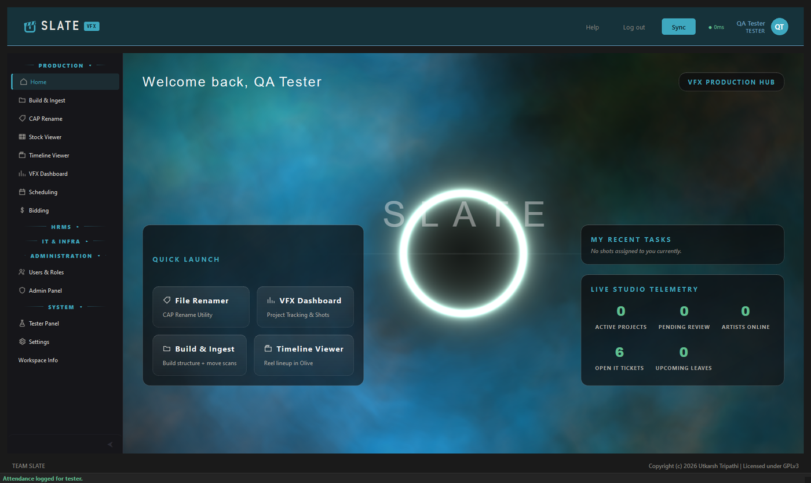
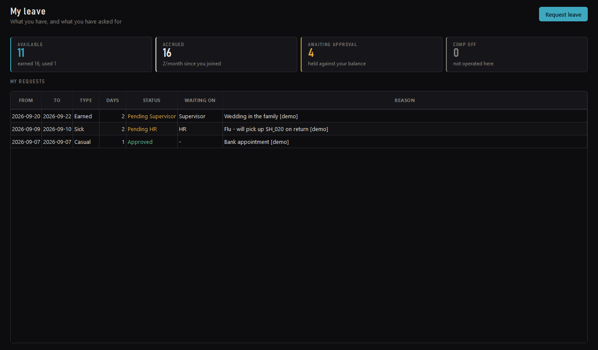
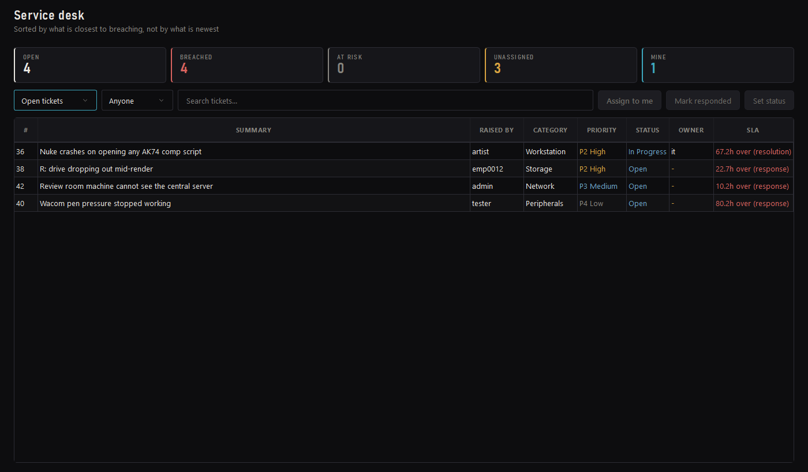
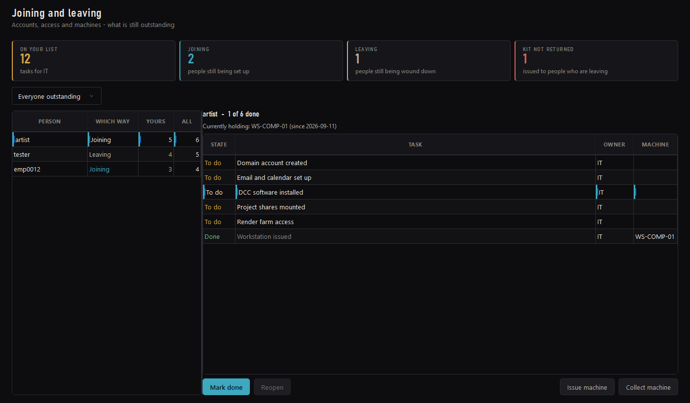
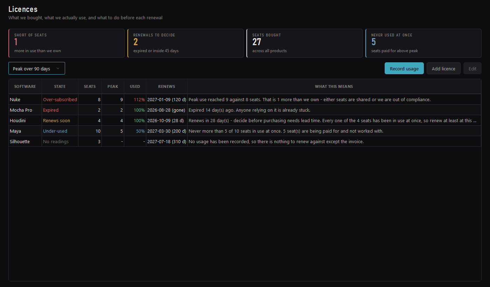

# Slate

**A studio pipeline that also knows the studio runs on people.**

Slate is a desktop tool for a VFX facility. It does the usual pipeline work — build a
shot structure, rename a thousand plates, track a reel through to final, review it —
and it does the part most pipeline tools leave to a spreadsheet: leave, attendance,
the IT queue, the machines, the licences, and who is joining or leaving this week.



---

## ⬇ Download

**[Get the installers from the latest release](https://github.com/capsuleutkarsh-design/slate-vfx/releases/latest)** — no Python, no setup scripts, nothing else to download.

The current version is **BETA 2.1.0**. What changed in each version is in the
[release notes](deployment/release_notes/).

| Installer | Install on |
|---|---|
| **Slate Server** setup | one always-on machine: it holds the studio database (PostgreSQL is included) |
| **Slate Studio** setup | artist, lead and supervisor workstations |
| **Slate Ops** setup | HR, IT and production office machines |

1. Install **Slate Server** first and create the database from its window.
2. Install **Studio** or **Ops** on the other machines. They find the server on the network by themselves.
3. Sign in as **admin** with the password **admin123**, change that password straight away, then add people under **Users & Roles** (one by one, or import a CSV / Excel list). See [First sign-in](#first-sign-in).

Windows 10 or 11, 64-bit. The installers are not code-signed yet, so Windows may show *"Windows protected your PC"*: click **More info → Run anyway**.

Developers, or anyone who wants to run from the code instead, see [Getting it running](#getting-it-running) below.

---

## The idea it is built around

**What you see is decided by what you are.** There is no mode switch and no
permission toast. An artist opening *Leave* gets their own balance and a button to
ask for time off. HR opening the same entry gets the approval queue. IT opening
*Tickets* gets the service desk; everyone else gets their own tickets and the
conversation on them.

That sounds small. It is the difference between a module people use and one that
looks broken — an earlier version showed every screen from the manager's side, so an
artist had nothing to do on it and nobody could create the records the manager's
screen was listing.

| | An artist sees | HR and IT see |
|---|---|---|
| **Leave** | Balance, what a request will cost, what happened to the last one | The queue, waiting on them first, and the year end |
| **Tickets** | Raise one, read the replies | The desk, sorted by what breaches soonest |
| **Joining & Leaving** | *nothing — the entry is absent* | Their own half of the checklist |

---

## What is in it

### Production

- **Build & Ingest** — lay down a shot structure from a template and move scans into it.
- **CAP Rename** — batch rename with search/replace and sequence serialising; understands an image sequence as one item rather than 1,200 files.
- **Stock Viewer** — the studio's stock library, with thumbnails, tags and a search that reaches into metadata.
- **Timeline Viewer** — reel lineup: play it in RV, export an EDL for editorial.
- **VFX Dashboard** — shots, statuses, artists and departments, backed by the database or an Excel sheet.
- **Scheduling & Bidding** — who is on what, and what a job should cost.

### People

- **Leave** — accrual by completed month, a six-day week, a public holiday calendar, and the sandwich rule worked out and *explained* before the artist commits to a request. Two stages: supervisor, then HR.
- **Attendance** — punch in and out. Comp-off is earned from that record rather than typed in by hand, for the studios that operate it.
- **Joining & Leaving** — one checklist read in two directions. Every access granted on the way in has a matching revocation on the way out, and the machine issued on day one is named on the row when that person leaves.

### IT

- **Service desk** — priority derived from impact and urgency through an ITIL grid, not picked from a dropdown. Response and resolution clocks, and a queue sorted by what breaches soonest.
- **Hardware** — the fleet, and who is holding what.
- **Licences** — seats bought against *peak concurrent use*, so a renewal is decided on evidence. It says when you are over-subscribed, and when you are paying for seats nobody has ever used at once.

<table>
<tr>
<td width="50%"><br><sub><b>An artist's leave</b> — the balance, and what each request actually cost</sub></td>
<td width="50%"><br><sub><b>The service desk</b> — sorted by what breaches soonest</sub></td>
</tr>
<tr>
<td><br><sub><b>Joining &amp; Leaving</b> — IT's half of the checklist</sub></td>
<td><br><sub><b>Licences</b> — every row says what it means for the renewal</sub></td>
</tr>
</table>

---

## Running a studio on it

### First sign-in

A brand-new studio database starts with one administrator account:

| User name | Password |
|---|---|
| `admin` | `admin123` |

**Change this password straight away.** Anyone who has read this page knows it.
Click your name at the top of the Slate window and choose **Change password…**.

Then add your people under **Users & Roles**, one by one or with
**Import from Excel / CSV…**. The same screen has **Reset Password** for anyone
who forgets theirs.

- The `admin` account cannot be deleted: Slate puts it back the next time it
  starts, so nobody is ever locked out. Keep its password safe instead.
- A new database also gets two practice accounts, `artist` / `artist123` and
  `tester` / `tester123`. Delete them under **Users & Roles** once your real
  people are in, or give them new passwords.

### Opening a shot in Nuke, Blender and other programs

In the **VFX Dashboard**, the shot panel has an **Open In** row: NukeX, Natron,
Silhouette, After Effects, Premiere Pro, Blender and RV. Right-clicking a shot
also has a **Launch DCC** menu.

- **Slate finds the program by itself.** It looks in `C:\Program Files` for any
  version and picks the newest one, for example
  `C:\Program Files\Nuke15.1v3\Nuke15.1.exe` or
  `C:\Program Files\Blender Foundation\Blender 4.2\blender.exe`.
  It remembers what it found.
- **If it cannot find it**, it asks you to pick the program's `.exe` file once,
  and remembers your choice.
- **After an upgrade** (the old version removed), Slate notices the remembered
  program is gone, searches again and remembers the new one.
- **Nuke opens as NukeX.** To change this, go to **Settings → Core Configuration
  → Open Nuke as**, choose **NukeX**, **Nuke** or **Nuke Studio**, and click
  **Save changes**. This is set on each computer separately.
- From the shot panel, Nuke and Blender open the shot's newest script
  (`.nk` or `.blend`) if it has one; otherwise the program opens empty.
  After Effects and Premiere Pro ask you to choose a project if the shot has
  none. The right-click menu opens the program without a file.

### Updating to a new version

1. On the server computer, open **Slate Server → Operations** and click
   **Back up now** (see [Backups](#backing-up-and-restoring-the-database)).
2. Download the new installers from the
   [latest release](https://github.com/capsuleutkarsh-design/slate-vfx/releases/latest).
3. Run the new **Slate Server** setup on the server computer, **over the old
   one** — do not uninstall first. It closes the running server, replaces the
   program, and keeps the database, the backups and the server's settings. It
   asks for the shared `Slate_Central` folder again: give the same one as before.
4. Then run the new **Slate Studio** or **Slate Ops** setup on each workstation,
   over the old one. It keeps that computer's settings, its server address and
   its offline copy.

Updating the server first and the workstations after is our suggestion, not a
rule the installers enforce.

Your data is only removed if you **uninstall** and answer **Yes** to *"Delete its
settings and data as well?"* The default answer is **No**. On the server
computer, **Yes deletes the studio's whole database and its backups**.

Studios that put update packages in their shared folder
(`Slate_Central\Updates\releases`) can also update from
**Settings → System Maintenance → Check Updates**.

### Backing up and restoring the database

Everything the studio enters — shots, people, leave, attendance, tickets — is in
one database on the server computer.

**To back up:** open **Slate Server → Operations** and click **Back up now**.

- Each backup is one `.dump` file named with its date and time. They go in a
  **Backups** folder next to the database folder; on a normal install that is
  `%LOCALAPPDATA%\Slate_Central\Backups` on the server computer.
- **Slate does not take backups on its own.** The Operations screen says how long
  ago the last one was, and shows it in red when it is more than a day old.
  We suggest one every day.
- **Keep a copy somewhere else too** (another disk or the NAS). If the server's
  disk fails, backups on that same disk are lost with it.
- **Tidy up** deletes backups older than the days you choose, but always keeps
  the newest ones (7 unless you change it).

**To restore:** close Slate on every workstation, then open **Slate Server →
Operations → Restore from file...** and pick a `.dump` file. This **replaces
everything** in the database with that backup and cannot be undone, so take a
fresh backup first. Start Slate on the workstations again when it has finished.

The **Create Backup** card in Slate's own Settings is different: it zips a folder
you choose. It does not back up the database.

### Network ports and the firewall

The server computer must accept these:

| Port | Type | What it is for |
|---|---|---|
| 5440 | TCP | the database (PostgreSQL) |
| 6432 | TCP | the connection pool (PgBouncer). Workstations try this first |
| 54320 | UDP | discovery: workstations asking "where is the server?" |
| 8000 | TCP | the web API and admin dashboard — only needed if you open it from another computer |

In **Slate Server → Settings**, the **Allow Firewall** button adds Windows
Firewall rules for the database, pool and discovery ports (Windows asks for
administrator permission). It does not open 8000. The database and pool port
numbers can be changed on the same screen; if you change them, open the new
numbers instead.

### The server computer

Slate does not check any of this. It is our suggestion for a small to medium studio:

- one computer that stays on while people work, 64-bit Windows 10 or 11
- 8 GB of memory or more
- an SSD with at least 20 GB free for the database and its backups — backups
  add up, so keep an eye on the space
- a fixed IP address (ask IT to reserve one), so workstations always find it

### When something goes wrong

**A workstation cannot find the server**

- Check that **Slate Server** is running on the server computer and that
  **Database Server Power** is on in its Dashboard.
- Click **Allow Firewall** in **Slate Server → Settings** (see above).
- Finding the server automatically only works when the workstation and the
  server are on the same local network. Otherwise, type the server's IP address
  in Slate: **Settings → Paths & Connections → DB Host** (port **5440**), click
  **Save Paths & Connections** and restart Slate.
- If Slate says it is in **local mode**, it could not reach the database and is
  working on an offline copy on this computer. Changes made there are not
  shared with anyone.

**Nuke, Blender or another program is not found, or the wrong version opens**

- If the program is not in `C:\Program Files`, pick its `.exe` when Slate asks.
  Slate remembers it.
- To make Slate forget a remembered program, open
  `%LOCALAPPDATA%\Slate\settings.json` in Notepad, find the line for that
  program (`dcc_path_nuke`, `dcc_path_blender`, `dcc_path_natron`,
  `dcc_path_silhouette`, `dcc_path_after_effects` or `dcc_path_premiere`) and
  change its value to `""`. Next time, Slate searches again and picks the newest
  version. You can also type the full path there, writing each `\` as `\\`.
- IT can set the path for a whole machine with an environment variable:
  `Slate_NUKE_PATH`, `Slate_BLENDER_PATH`, `Slate_NATRON_PATH`,
  `Slate_SILHOUETTE_PATH`, `Slate_AFTER_EFFECTS_PATH` or `Slate_PREMIERE_PATH`.
  It is used when Slate has not remembered a program yet.

**Nuke opens but asks for a NukeX licence**

That computer is licensed for plain Nuke. Set **Settings → Core Configuration →
Open Nuke as** to **Nuke** and click **Save changes**.

**Anything else**

**Settings → System Maintenance → View Logs** opens the folder with Slate's log
files. Send the newest one with your question (see below).

### Help and contact

- **Report a problem or ask for something new:**
  [GitHub Issues](https://github.com/capsuleutkarsh-design/slate-vfx/issues)
- **Email:** [capsuleutkarsh@gmail.com](mailto:capsuleutkarsh@gmail.com)

Please say which version you have (it is in the installer's name, for example
`setup_Slate_Studio_vBETA 2.1.0.exe`), what you did, and what happened.
A screenshot helps.

---

## Getting it running

*This is the route from the source code. Most people want the [installers](#-download) instead.*

**Clone or download this repository, then double-click `setup.bat`.**

That is the whole install. It downloads a portable Python, FFmpeg and the rest,
installs the dependencies, asks once for the studio's database details, and writes
three launchers. Nothing goes into the registry or onto `PATH`, no Python already on
the machine is touched, and deleting the folder removes it.

```
setup.bat              install what is missing
setup.bat /check       say what it would do, download nothing
setup.bat /server      also install PostgreSQL (the Central Server machine only)
setup.bat /force       re-download even what is already there
```

Then:

| | |
|---|---|
| `Slate.bat` | the main client |
| `Slate Ops.bat` | the operations shell |
| `Slate Server.bat` | Central Server — database, pooler and sync |

Running setup twice is safe: anything already in place is skipped, and an interrupted
download resumes rather than leaving a half file the next run mistakes for a whole one.

**Requirements:** Windows 10 or 11, 64-bit. Around 300 MB of downloads on a
workstation, plus another 300 MB of PostgreSQL on the server machine.

### Without a server

Leave the database password blank during setup and Slate starts on a local SQLite
database. Everything works; nothing is shared between machines. Re-run `setup.bat`
when the server is ready.

---

## About credentials

This repository is public, so **it contains no passwords.**
`slate/default_config.json` carries settings only. `setup.bat` writes the real
values to `slate/config.json`, which is git-ignored and never leaves the machine.

Migrating from a private checkout? Keep your existing password — nothing about it
needs to change, it just moves into the local file.

---

## How it is put together

```
slate/
  core/
    domain/        the rules. Leave policy, the SLA matrix, licence
                   compliance, the joining spine. No Qt and no SQL - these
                   are the files to read to learn what the studio does.
    infra/         the database, the repositories, the migrations, and
                   gate.py: the one palette the whole product draws from.
  gui/
    core/          the design system - icons, controls, empty states
    tabs/          one file per screen
slate_server/         Central Server - PostgreSQL, PgBouncer, sync
tests/             1,453 of them
tools/             seeding and maintenance
docs/              this site, and the studio guide
setup/             what setup.bat downloads, and from where
```

Two conventions worth knowing before changing anything:

- **Policy lives in `core/domain` and nowhere else.** Leave types, ticket priorities
  and licence thresholds are each defined once. A screen that works out a day count
  itself is a bug, because the balance on one screen and the queue on another then
  disagree about the same person.
- **Colour comes from `core/infra/gate.py`.** Chrome is achromatic; saturation is
  reserved for meaning. A hard-coded hex in a widget is how the last theme was
  defeated: 698 inline stylesheets overruling a global one that changed 0.02% of
  pixels.

### Tests

```
runtime\python\python.exe -m pytest tests/ -q
```

---

## Documentation

**[The studio guide](docs/guide/)** — written for the people who use it, not the
people who build it: [artists](docs/guide/artists.md) ·
[supervisors](docs/guide/supervisors.md) · [HR](docs/guide/hr.md) ·
[IT](docs/guide/it.md).

**[Installing it](docs/install.md)** ·
**[Architecture](docs/architecture.md)** ·
**[Working on it](docs/development.md)** ·
**[All documentation](docs/)**

---

## Licence

Slate is released under the **[UT Community Licence 2.0](LICENSE.md)** by Utkarsh Tripathi.
In short: **free to use**, also for paid studio work; **not for sale**; if you change it,
keep the name as *Slate (modified by …)* and **send your changes back as a pull request**
within 30 days; keep the credits and the *Slate · © 2026 Utkarsh Tripathi · UT Community
Licence 2.0* line at the bottom of the windows, or Slate will not start. The Blender and
Natron plug-in folders are also available under MIT. Copies up to BETA 2.0.29 keep the GPLv3.

Icons by Icons8 - https://icons8.com

The Icons8 icons, the product logos on the launch buttons, and the OpenRV folder
the Studio installer ships (and what is left out of it on purpose) are covered
in [THIRD_PARTY_NOTICES.md](THIRD_PARTY_NOTICES.md).

FFmpeg, PostgreSQL and OpenRV are not in this repository. `setup.bat`
fetches FFmpeg and PostgreSQL from their own projects; OpenRV has no
public Windows build and is supplied by the studio. Each keeps its own licence.
